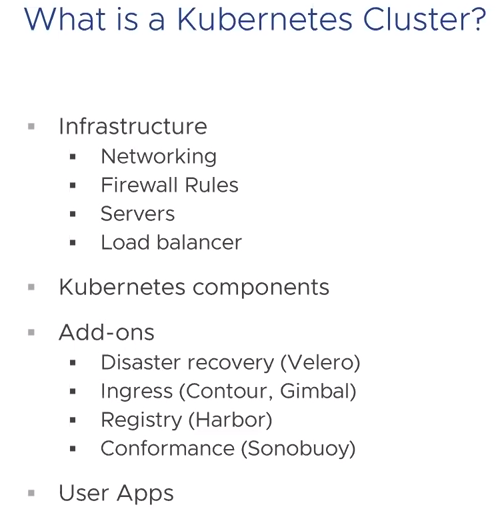
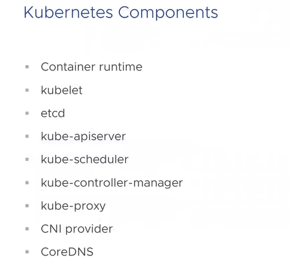
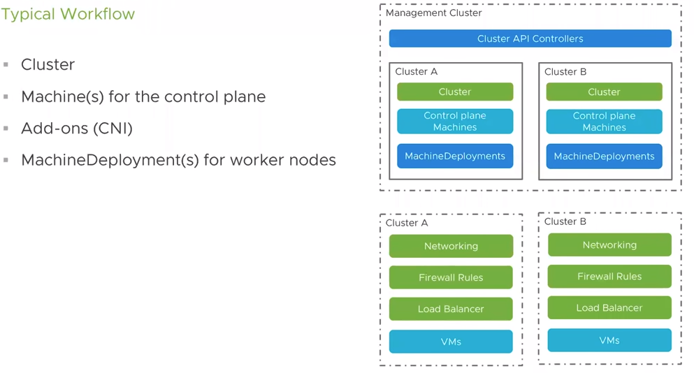

# Cluster API

## Kubernetes



Kuberentes Cluster is made of lot of things. You need Infastructure with networking firewall rules, servers and load balancing and kuberentes componentes.
You might have add-ons for your cluster.

### Kubernetes Components



You need container runtime which might be docker, container runtime.
kubelet - responsible to taking the pods and running them on the system
etcd  - database
apiserver - component for creating resources
scheduler - takes cares of which nodes has resoures to run the pods
controller - process to control the control object like namespace controller ...
kube-proxy - inter service networking
CNI - pod to pod networking
CoreDNS - or cluster DNS

Now these components can be bootstraped and configured manually DIY, using various installer. This is solved by **kubeadm take care by SIG**.

#### Kubeadm

* Proves a consistent cluster bootstrapping experience
  * Decalrative configuration model (InitConfiguration, ClusterConfiguration, JoinConfiguration)
  * kubeadmn init: create a new control plane node
  * kubeadmn join: join a new control plane or worker node

Kubeadmn does cluster life cycle mgmt however it does not do kubernetes infrastructure life cycle mgmt. Infastrcutre LCM can be done by kops, DIY, kubespray ...., managed kubernetes provider.. hence you might need different tools to achieve the end to end solution with proper uniformity, consistency, easy to use, simplicity . Thus the solution is **Cluster API**

### Cluster API

* Declarative LCM of Kuberńetes clusters
  * Create, Scale, Upgrade, Delete the cluster (infra)

#### Overview:

Cluster API is a declarative API specification. It is this API specification that helps provide uniform and consistent management for Kubernetes clusters regardless of the underlying infrastructure. For v1alpha1, the API comprises five CustomResourceDefinitions, or CRDs: **Cluster, Machine, MachineSet, MachineDeployment, and MachineClass**. Let’s look at each of these in turn.

* CustomResourceDefinations (CRDs)

* Common logic

* Provider specific logic
    * vSphere (CAPV)
    * AWS (CAPA)
    * Azure (CAPZ)
    * GCE
    * ...

#### CRDs

* Cluster
Cluster provides a way to define common Kubernetes cluster configurations, such as pod network CIDR and service network CIDR, as well as provider-specific management of shared cluster infrastructure. Creating a Cluster that uses the AWS provider as an example will instantiate a VPC, public and private subnets, an Internet gateway, a NAT gateway, security groups, an elastic load balancer, and a bastion host. A provider-specific configuration is provided through an embedded ProviderSpec that is defined and decoded by the individual provider implementations. There is also an embedded ProviderStatus that may be used by provider implementations for providing end-user viewable status.

* Spec
    * pod CIDR
    * service CIDR
    * service CIDR suffix
    * embedded provider-specific configuration
* Status
    * API server endpoints
    * Error details
    * embedded provider-specific status

Here’s an example of a YAML file for a Cluster that uses AWS as its provider:

```sh
apiVersion: "cluster.k8s.io/v1alpha1"
kind: Cluster
metadata:
  name: test1
spec:
  clusterNetwork:
    services:
      cidrBlocks: ["10.96.0.0/12"]
    pods:
      cidrBlocks: ["192.168.0.0/16"]
    serviceDomain: "cluster.local"
  providerSpec:
    value:
      apiVersion: "awsprovider/v1alpha1"
      kind: "AWSClusterProviderSpec"
      region: "us-east-1"
      sshKeyName: "default"
```

One thing that may **not be obvious at first is that creating a Cluster does not actually result in a fully functioning Kubernetes cluster. To get to that point, you need to instantiate one or more Machines.**

### Machine

The Machine CRD is really the backbone for managing Kubernetes clusters in v1alpha1. It is responsible for describing an individual Kubernetes node. There is only minimal configuration exposed at the common configuration level (mainly Kubernetes version information), and additional configuration is exposed through the embedded ProviderSpec.

* Spec
  * Kubelet, contral plane version
  * provder-specific configuration or MachineClass ref
  * Provider ID
  * Node Taints

* Status
  * Node reference
  * Kubelet, contraol plane versions
  * embedded provider-specific status
  * .....

Here’s an example of a YAML file that instantiates a Machine:

```sh
apiVersion: "cluster.k8s.io/v1alpha1"
kind: Machine
metadata:
  name: controlplane-0
  labels:
    cluster.k8s.io/cluster-name: test1
    set: controlplane
spec:
  versions:
    kubelet: v1.13.6
    controlPlane: v1.13.6
  providerSpec:
    value:
      apiVersion: awsprovider/v1alpha1
      kind: AWSMachineProviderSpec
      instanceType: "t2.medium"
      iamInstanceProfile: "control-plane.cluster-api-provider-aws.sigs.k8s.io"
      keyName: "default"
```

**Machines are currently responsible for deploying both Control Plane and Worker Nodes and the distinction between each is currently provider-dependent. Support for multiple Control Plane Nodes is also currently provider-dependent in v1alpha1.**

### MachineDeployment

MachineDeployments allow for the managed deployment and rollout of configuration changes to groups of Machines, very much like Deployments work. This **allows for rolling out updates to a node configuration or even rolling out version upgrades for worker nodes in the cluster in an orchestrated manner**. It also allows for rolling back to the previous configuration. It is important to note that MachineDeployments should not be used for managing Machines that make up the Kubernetes Control Plane for a given managed Cluster, since they do not provide any assurances that the control plane remains healthy when the MachineDeployment is updated or scaled.

```sh
apiVersion: "cluster.k8s.io/v1alpha1"
kind: MachineDeployment
metadata:
  name: sample-machinedeployment
  labels:
    cluster.k8s.io/cluster-name: test1
spec:
  replicas: 1
  selector:
    matchLabels:
      cluster.k8s.io/cluster-name: test1
      set: node
  template:
    metadata:
      labels:
        cluster.k8s.io/cluster-name: test1
        set: node
    spec:
      versions:
        kubelet: v1.13.6
      providerSpec:
        value:
          apiVersion: awsprovider/v1alpha1
          kind: AWSMachineProviderSpec
          instanceType: "t2.medium"
          iamInstanceProfile: "nodes.cluster-api-provider-aws.sigs.k8s.io"
          keyName: "default"
```

### MachineSet

MachineSets manage groups of Machines in a way that’s similar to how ReplicaSets manage groups of pods. This allows for simplified scaling of a group of worker nodes in a Cluster. Like MachineDeployments, MachineSets should not be used for managing control plane nodes for a Cluster. Just as with ReplicaSets, most users should not manage MachineSets directly and should instead prefer to use MachineDeployments for managing groups of Machines.

```sh
apiVersion: "cluster.k8s.io/v1alpha1"
kind: MachineSet
metadata:
  name: sample-machineset
  labels:
    cluster.k8s.io/cluster-name: test1
spec:
  replicas: 1
  selector:
    matchLabels:
      cluster.k8s.io/cluster-name: test1
      set: node
  template:
    metadata:
      labels:
        cluster.k8s.io/cluster-name: test1
        set: node
    spec:
      versions:
        kubelet: v1.13.6
      providerSpec:
        value:
          apiVersion: awsprovider/v1alpha1
          kind: AWSMachineProviderSpec
          instanceType: "t2.medium"
          iamInstanceProfile: "nodes.cluster-api-provider-aws.sigs.k8s.io"
          keyName: "default"
```

### MachineClass

With all of the previously described Machine objects, you can specify a provider-specific configuration. This can easily get repetitive and tedious if you are defining multiple Machines, MachineSets, or MachineDeployments. To ease this repetitive configuration, a reference to a MachineClass can be used in place of the embedded provider-specific configuration when defining a Machine, MachineSet, or a MachineDeployment.

```sh
apiVersion: "cluster.k8s.io/v1alpha1"
kind: MachineClass
metadata:
  name: sample-machineclass
providerSpec:
  value:
    apiVersion: awsprovider/v1alpha1
    kind: AWSMachineProviderSpec
    instanceType: "t2.medium"
    iamInstanceProfile: "nodes.cluster-api-provider-aws.sigs.k8s.io"
    keyName: "default"
```


#### Typical Cluster Creation




## Sources

* <https://www.youtube.com/watch?v=sCD50fO95hI>
* <https://developer.ibm.com/articles/cluster-api-manage-your-kubernetes-cluster-in-a-kubernetes-way/>
* <https://blogs.vmware.com/cloudnative/2019/05/14/cluster-api-kubernetes-lifecycle-management/>